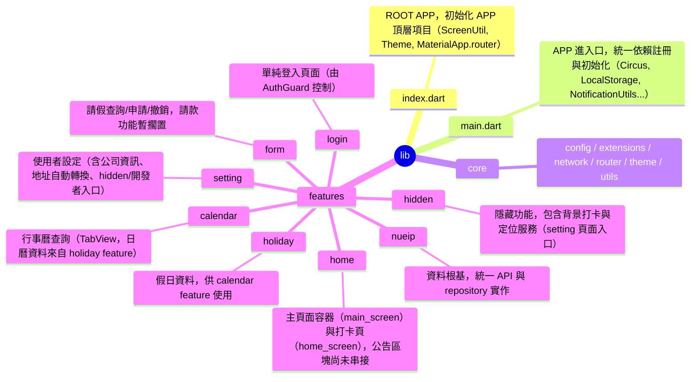

# Auto Nueip

一個基於 Flutter、利用 Joker State 實現 Clean Architecture 的 APP 版 NUEIP。
目前功能尚未完善，請以 NUEIP 官方網站為主要使用途徑，本 APP 為輔助工具。
**免責聲明： 本 APP 僅供學習與研究用途，未涉及任何商業利益與法律行為，請注意。**

---

## 專案架構總覽

本專案採用分層設計，並以功能模組（feature-first）為主軸，結合 DI（Circus）、狀態管理（Joker State）、自動路由（AutoRoute）、響應式設計（ScreenUtil）等最佳實踐。各層責任分明，易於擴充與維護。



---

## 主要功能模組

- **nueip**：所有功能的資料根基，負責 API 交互與資料統一管理。
- **login**：登入頁面，僅於 localStorage 無帳密時由 AuthGuard 導向。
- **home**：底部導覽主頁（main_screen），打卡頁（home_screen），公告區塊待補。
- **calendar**：TabView 提供單日/區間查詢，日曆資料整合 holiday。
- **form**：請假查詢、申請、撤銷，請款功能暫緩。
- **setting**：可編輯公司代碼、員工編號、密碼、公司地址（自動轉經緯度），含 hidden/開發者頁入口。
- **holiday**：假日資料來源，供 calendar 使用。
- **hidden**：隱藏功能（背景打卡、定位服務），入口於 setting 頁。

---

## 主要依賴與技術

- **狀態管理**：joker_state
- **依賴注入**：Circus（joker_state 的 DI）
- **路由管理**：auto_route（含路由守衛）
- **響應式設計**：flutter_screenutil
- **API 請求**：dio、cookie_jar、pretty_dio_logger 等
- **UI/UX**：google_fonts、gap、flutter_animate、dropdown_button2 等
- **表單/驗證**：flutter_form_builder、form_builder_validators
- **背景服務/通知**：flutter_background_service、flutter_local_notifications
- **地理定位**：geolocator（預計用於 hidden 定位服務）
- **資料處理**：freezed、json_serializable、intl、collection 等

---

## 開發說明

1. **依賴安裝**
   ```bash
   flutter pub get
   ```
2. **自動生成檔案**
   ```bash
   flutter pub run build_runner build --delete-conflicting-outputs
   ```
3. **啟動專案**
   ```bash
   flutter run
   ```
4. **專案結構與規範**
   - 嚴格遵循 Clean Architecture 與 SOLID 原則。
   - 每個 feature 皆有獨立 data/domain/presentation 分層。
   - 依賴註冊統一於 `main.dart`/`index.dart`。
   - UI 響應式設計統一由 ScreenUtil 初始化。
   - 路由統一由 AutoRoute 管理，並設有 AuthGuard。
---

## 進階設計理念

- **功能模組化**：每個 feature 皆可獨立維護與擴充。
- **資料來源統一**：nueip 為所有 presenter 的資料根基（除 holiday 外）。
- **隱藏功能**：hidden 預計支援背景打卡與定位自動打卡，入口於 setting 頁。
- **可測試性/可維護性**：強制介面抽象與分層、狀態不可變、mock-friendly 設計。

---

## 參考資源

- [Flutter 官方文件](https://docs.flutter.dev/)
- [Joker State](https://pub.dev/packages/joker_state)
- [AutoRoute](https://pub.dev/packages/auto_route)
- [Flutter ScreenUtil](https://pub.dev/packages/flutter_screenutil)