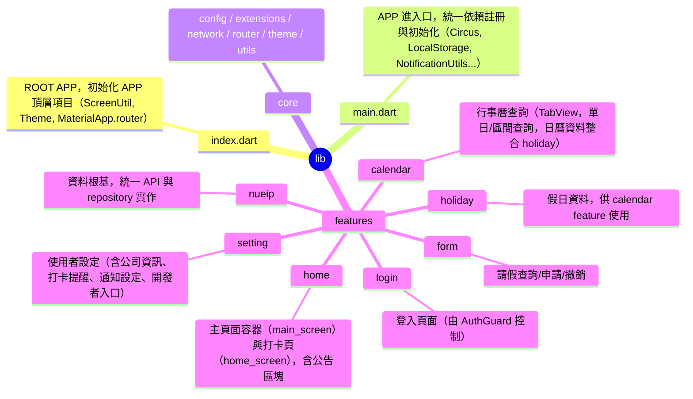

# Auto Nueip

**⚠️免責聲明： 本 APP 僅供學習與研究用途，未涉及任何商業利益與法律行為，請注意。**

一個基於 Flutter、利用 Joker State 實現 Clean Architecture 的 APP 版 NUEIP。
目前功能已相當完善，提供完整的 NUEIP 服務體驗，但仍建議與官方網站交叉使用。

---

## 專案架構總覽

本專案採用分層設計，並以功能模組（feature-first）為主軸，結合 DI（Circus）、狀態管理（Joker State）、自動路由（AutoRoute）、響應式設計（ScreenUtil）等最佳實踐。各層責任分明，易於擴充與維護。



---

## 主要功能模組

### 🚀 **核心功能**
- **nueip**：所有功能的資料根基，負責 API 交互與資料統一管理。
- **login**：登入頁面，僅於 localStorage 無帳密時由 AuthGuard 導向。
- **home**：底部導覽主頁（main_screen），智能打卡頁（home_screen），公告區塊。

### 📅 **功能模組**
- **calendar**：TabView 提供單日/區間查詢，支援下拉刷新，日曆資料整合 holiday。
- **form**：請假查詢、申請、撤銷功能，支援下拉刷新。

### ⚙️ **設定與服務**
- **setting**：完整的使用者設定功能：
  - ✅ 帳號資訊管理（編輯/清除）
  - ✅ 深色模式切換
  - ✅ 通知系統設定
  - 🆕 **工作日打卡提醒**（可自訂上下班時間）
  - ✅ APP 版本自動獲取
  - ✅ 開發者資訊頁面
- **holiday**：假日資料來源，供 calendar 使用。

---

## 🌟 新功能亮點

### 📍 **GPS 打卡功能**
- 智能定位打卡，不再依賴固定地址
- 支援 GPS 開關切換
- 自動獲取當前地址資訊

### 🔔 **工作日打卡提醒**
- 可自訂上下班提醒時間
- 智能檢查打卡狀態，避免重複提醒
- 僅在工作日（週一至週五）發送提醒
- 打卡後自動取消當天對應提醒

### 🔄 **下拉刷新功能**
- 所有主要頁面支援下拉刷新
- HomeScreen：更新打卡時間與登入資訊
- CalendarScreen：重新查詢行事曆資料
- FormScreen：重新載入請假紀錄
- SettingScreen：重新獲取使用者資料

### 📱 **版本管理**
- 自動獲取 APP 版本號
- 動態顯示於設定頁面

### 🎨 **UI/UX 改進**
- 移除多餘的 RefreshButton，改用下拉刷新
- 統一的載入狀態管理
- 完善的錯誤處理與用戶反饋

---

## 主要依賴與技術

### 🧠 **核心框架**
- **狀態管理**：joker_state
- **依賴注入**：Circus（joker_state 的 DI）
- **路由管理**：auto_route（含路由守衛）
- **響應式設計**：flutter_screenutil

### 🌐 **網路與資料**
- **API 請求**：dio、cookie_jar、pretty_dio_logger
- **資料處理**：freezed、json_serializable、intl、collection

### 🎨 **UI/UX**
- **字型**：google_fonts
- **動畫**：flutter_animate
- **間距**：gap
- **表單**：dropdown_button2、flutter_form_builder、form_builder_validators

### 📍 **定位與通知**
- **地理定位**：geolocator
- **本地通知**：flutter_local_notifications
- **背景服務**：flutter_background_service
- **時區處理**：timezone
- **應用程式資訊**：package_info_plus

---

## 開發說明

### 1. **環境設置**
```bash
# 安裝依賴
flutter pub get

# 自動生成檔案（模型、路由等）
make code
# 或
flutter pub run build_runner build --delete-conflicting-outputs

# 啟動開發伺服器
flutter run

# 建置 APK
make build
# 或
flutter build apk --split-per-abi
```

### 2. **專案結構與規範**
- 嚴格遵循 Clean Architecture 與 SOLID 原則
- 每個 feature 皆有獨立 data/domain/presentation 分層
- 依賴註冊統一於 `main.dart`
- UI 響應式設計統一由 ScreenUtil 管理
- 路由統一由 AutoRoute 管理，並設有 AuthGuard

### 3. **程式碼品質**
- 完整的錯誤處理機制
- 統一的狀態管理模式
- 完善的日誌記錄
- 測試友好的設計架構

---

## 參考資源

- [Flutter 官方文件](https://docs.flutter.dev/)
- [Joker State](https://pub.dev/packages/joker_state)
- [AutoRoute](https://pub.dev/packages/auto_route)
- [Flutter ScreenUtil](https://pub.dev/packages/flutter_screenutil)
- [Geolocator](https://pub.dev/packages/geolocator)
- [Flutter Local Notifications](https://pub.dev/packages/flutter_local_notifications)

---

## 貢獻指南

歡迎提交 Issue 和 Pull Request！請確保：

1. 遵循現有的程式碼風格
2. 添加適當的測試
3. 更新相關文檔
4. 確保所有檢查通過

---

## 授權

本專案僅供學習研究使用，請勿用於商業用途。