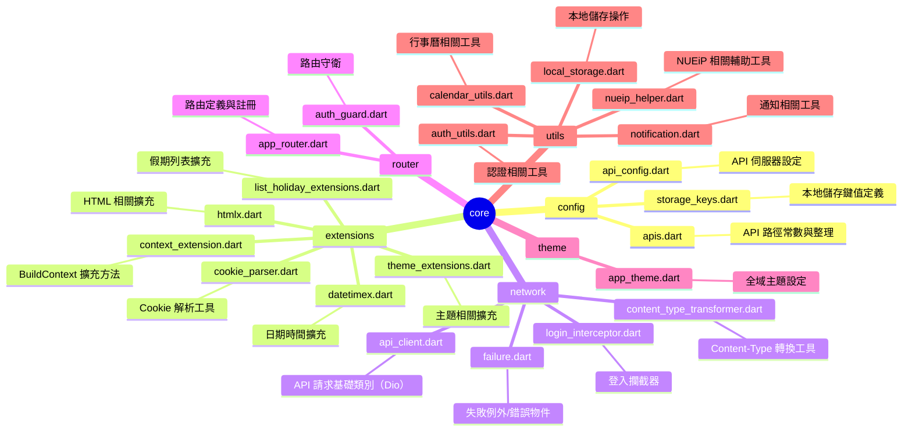

```mermaid
mindmap
  root((core))
    config
      api_config.dart
        API 伺服器設定
      apis.dart
        API 路徑常數與整理
      storage_keys.dart
        本地儲存鍵值定義
    extensions
      context_extension.dart
        BuildContext 擴充方法
      cookie_parser.dart
        Cookie 解析工具
      datetimex.dart
        日期時間擴充
      htmlx.dart
        HTML 相關擴充
      list_holiday_extensions.dart
        假期列表擴充
      theme_extensions.dart
        主題相關擴充
    network
      api_client.dart
        API 請求基礎類別（Dio）
      content_type_transformer.dart
        Content-Type 轉換工具
      failure.dart
        失敗例外/錯誤物件
      login_interceptor.dart
        登入攔截器
    router
      app_router.dart
        路由定義與註冊
      auth_guard.dart
        路由守衛
    theme
      app_theme.dart
        全域主題設定
    utils
      auth_utils.dart
        認證相關工具
      calendar_utils.dart
        行事曆相關工具
      local_storage.dart
        本地儲存操作
      notification.dart
        通知相關工具
      nueip_helper.dart
        NUEiP 相關輔助工具
```
