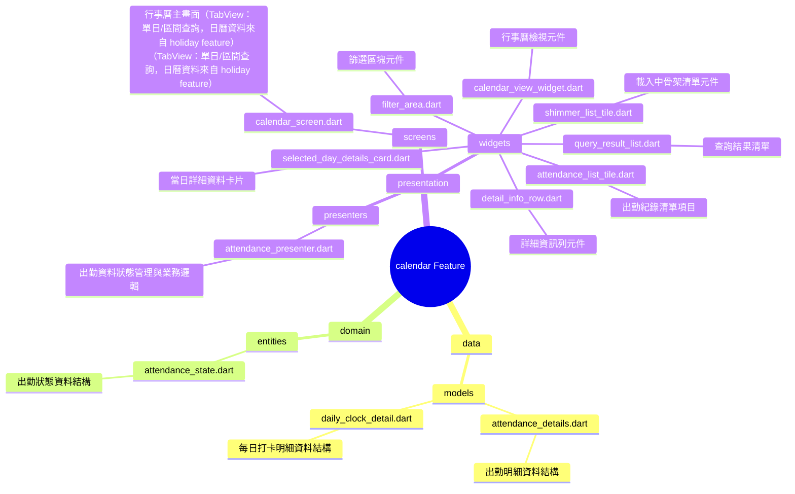

```mermaid
mindmap
  root((calendar Feature))
    data
      models
        attendance_details.dart
          出勤明細資料結構
        daily_clock_detail.dart
          每日打卡明細資料結構
    domain
      entities
        attendance_state.dart
          出勤狀態資料結構
    presentation
      presenters
        attendance_presenter.dart
          出勤資料狀態管理與業務邏輯
      screens
        calendar_screen.dart
          行事曆主畫面（TabView：單日/區間查詢，日曆資料來自 holiday feature）（TabView：單日/區間查詢，日曆資料來自 holiday feature）
      widgets
        attendance_list_tile.dart
          出勤紀錄清單項目
        calendar_view_widget.dart
          行事曆檢視元件
        detail_info_row.dart
          詳細資訊列元件
        filter_area.dart
          篩選區塊元件
        query_result_list.dart
          查詢結果清單
        selected_day_details_card.dart
          當日詳細資料卡片
        shimmer_list_tile.dart
          載入中骨架清單元件
```
