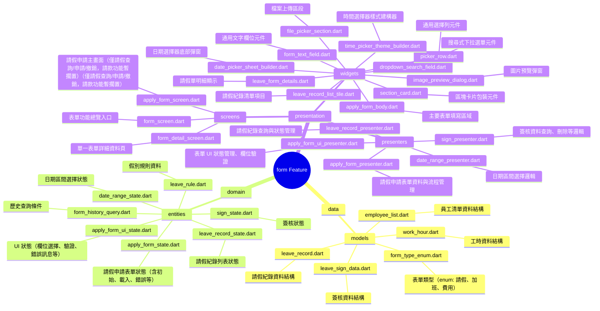

```mermaid
mindmap
  root((form Feature))
    data
      models
        employee_list.dart
          員工清單資料結構
        form_type_enum.dart
          表單類型（enum: 請假、加班、費用）
        leave_record.dart
          請假紀錄資料結構
        leave_sign_data.dart
          簽核資料結構
        work_hour.dart
          工時資料結構
    domain
      entities
        apply_form_state.dart
          請假申請表單狀態（含初始、載入、錯誤等）
        apply_form_ui_state.dart
          UI 狀態（欄位選擇、驗證、錯誤訊息等）
        date_range_state.dart
          日期區間選擇狀態
        form_history_query.dart
          歷史查詢條件
        leave_record_state.dart
          請假紀錄列表狀態
        leave_rule.dart
          假別規則資料
        sign_state.dart
          簽核狀態
    presentation
      presenters
        apply_form_presenter.dart
          請假申請表單資料與流程管理
        apply_form_ui_presenter.dart
          表單 UI 狀態管理、欄位驗證
        date_range_presenter.dart
          日期區間選擇邏輯
        leave_record_presenter.dart
          請假紀錄查詢與狀態管理
        sign_presenter.dart
          簽核資料查詢、刪除等邏輯
      screens
        apply_form_screen.dart
          請假申請主畫面（僅請假查詢/申請/撤銷，請款功能暫擱置）（僅請假查詢/申請/撤銷，請款功能暫擱置）
        form_detail_screen.dart
          單一表單詳細資料頁
        form_screen.dart
          表單功能總覽入口
      widgets
        apply_form_body.dart
          主要表單填寫區域
        date_picker_sheet_builder.dart
          日期選擇器底部彈窗
        dropdown_search_field.dart
          搜尋式下拉選單元件
        file_picker_section.dart
          檔案上傳區段
        form_text_field.dart
          通用文字欄位元件
        image_preview_dialog.dart
          圖片預覽彈窗
        leave_form_details.dart
          請假單明細顯示
        leave_record_list_tile.dart
          請假紀錄清單項目
        picker_row.dart
          通用選擇列元件
        section_card.dart
          區塊卡片包裝元件
        time_picker_theme_builder.dart
          時間選擇器樣式建構器
```
