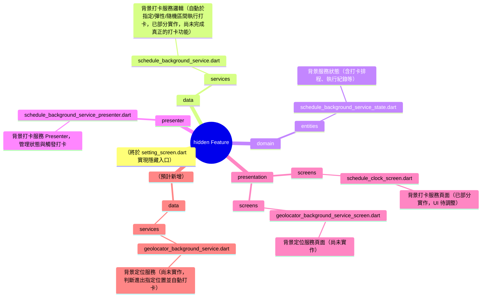

```mermaid
mindmap
  root((hidden Feature))
    （將於 setting_screen.dart 實現隱藏入口）
    data
      services
        schedule_background_service.dart
          背景打卡服務邏輯（自動於指定/彈性/隨機區間執行打卡，已部分實作，尚未完成真正的打卡功能）
    domain
      entities
        schedule_background_service_state.dart
          背景服務狀態（含打卡排程、執行紀錄等）
    presenter
      schedule_background_service_presenter.dart
        背景打卡服務 Presenter，管理狀態與觸發打卡
    presentation
      screens
        schedule_clock_screen.dart
          背景打卡服務頁面（已部分實作，UI 待調整）
      screens
        geolocator_background_service_screen.dart
          背景定位服務頁面（尚未實作）
    （預計新增）
      data
        services
          geolocator_background_service.dart
            背景定位服務（尚未實作，判斷進出指定位置並自動打卡）
```
