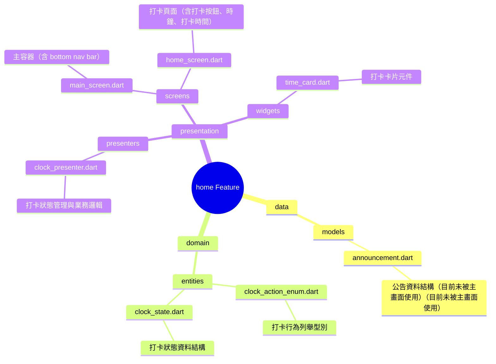

```mermaid
mindmap
  root((home Feature))
    data
      models
        announcement.dart
          公告資料結構（目前未被主畫面使用）（目前未被主畫面使用）
    domain
      entities
        clock_action_enum.dart
          打卡行為列舉型別
        clock_state.dart
          打卡狀態資料結構
    presentation
      presenters
        clock_presenter.dart
          打卡狀態管理與業務邏輯
      screens
        main_screen.dart
          主容器（含 bottom nav bar）
        home_screen.dart
          打卡頁面（含打卡按鈕、時鐘、打卡時間）
      widgets
        time_card.dart
          打卡卡片元件
```
