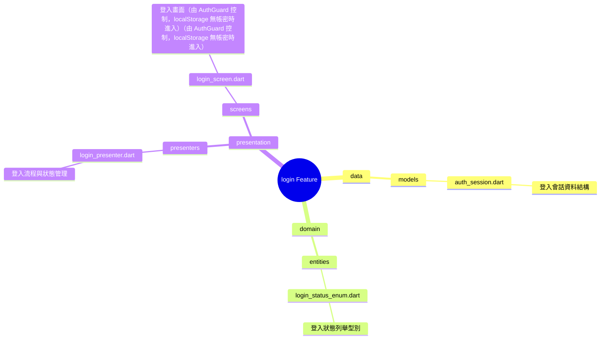

```mermaid
mindmap
  root((login Feature))
    data
      models
        auth_session.dart
          登入會話資料結構
    domain
      entities
        login_status_enum.dart
          登入狀態列舉型別
    presentation
      presenters
        login_presenter.dart
          登入流程與狀態管理
      screens
        login_screen.dart
          登入畫面（由 AuthGuard 控制，localStorage 無帳密時進入）（由 AuthGuard 控制，localStorage 無帳密時進入）
```

