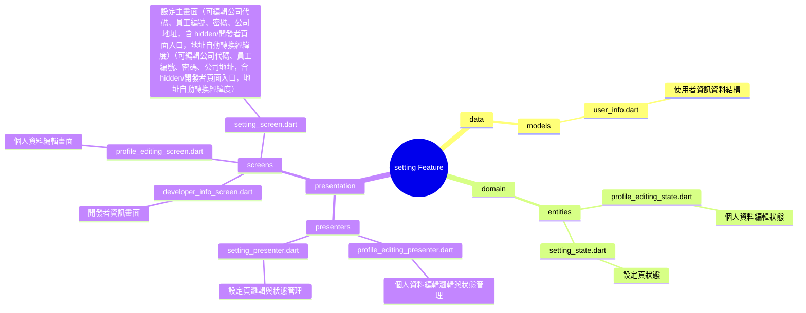

```mermaid
mindmap
  root((setting Feature))
    data
      models
        user_info.dart
          使用者資訊資料結構
    domain
      entities
        profile_editing_state.dart
          個人資料編輯狀態
        setting_state.dart
          設定頁狀態
    presentation
      presenters
        profile_editing_presenter.dart
          個人資料編輯邏輯與狀態管理
        setting_presenter.dart
          設定頁邏輯與狀態管理
      screens
        developer_info_screen.dart
          開發者資訊畫面
        profile_editing_screen.dart
          個人資料編輯畫面
        setting_screen.dart
          設定主畫面（可編輯公司代碼、員工編號、密碼、公司地址，含 hidden/開發者頁面入口，地址自動轉換經緯度）（可編輯公司代碼、員工編號、密碼、公司地址，含 hidden/開發者頁面入口，地址自動轉換經緯度）
```
