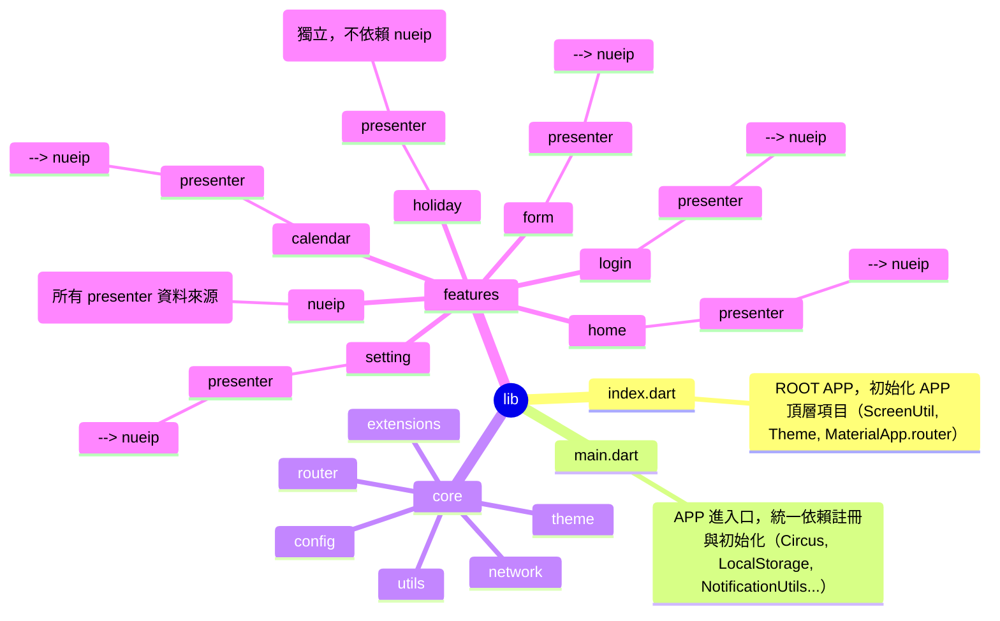
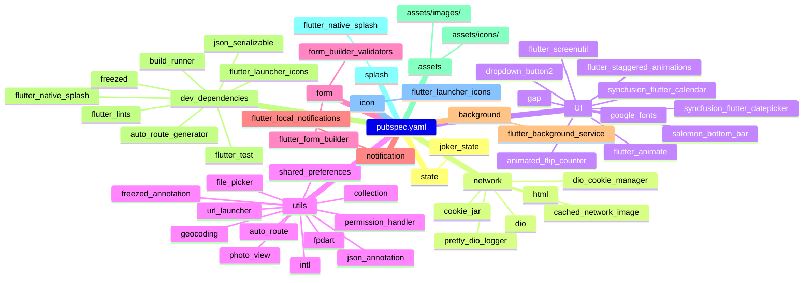

# 全域架構概覽

---

## 進度說明

- **目前進度**：除了 `hidden` 功能模組尚未完善，其餘 feature 皆已完成架構繪製。
- **特別提醒**：`home` 模組目前缺少公告區塊，`lib/features/home/data/models/announcement.dart` 尚未被實際串接或使用。
- 若需補足公告區塊串接或進行 hidden 模組設計，請再進一步指示。
